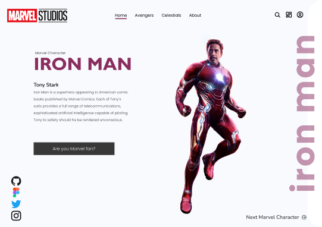
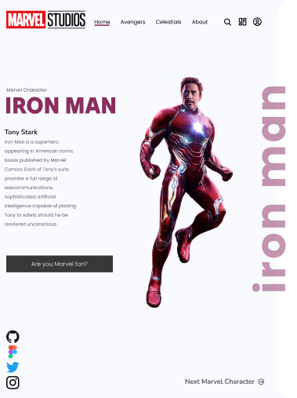
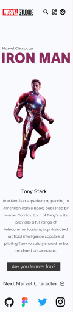

# Iron_Man

## Projeto de Site Responsivo – Disciplina de Linguagem de Marcação
Este projeto foi desenvolvido como parte da avaliação prática da disciplina de Linguagem de Marcação, ofertada pelo SENAI Jandira.

O objetivo central consistiu na criação de um site responsivo, a partir de um layout inicial pensado para ambientes desktop. A etapa inicial envolveu a prototipagem das versões adaptadas para tablets e dispositivos móveis, utilizando a ferramenta Figma. Durante essa fase, houve um cuidado especial na reorganização dos elementos visuais, da hierarquia das informações e da usabilidade para telas menores.

Na segunda etapa, o foco passou para a implementação do site por meio do framework Tailwind CSS. A principal preocupação foi garantir que o layout se adaptasse perfeitamente às três resoluções distintas: desktop, tablet e mobile, mantendo a consistência visual e funcional em todas elas.

## Como Rodar o Projeto Localmente
Siga os passos abaixo para visualizar o projeto em sua máquina:

Clone o repositório:
git clone https://github.com/Luana598/Iron_Man.git

Acesse a pasta do projeto:
cd Iron_Man

Use o arquivo index.html existente ou crie um novo:
Certifique-se de que a CDN do Tailwind CSS está incluída no seu HTML com a seguinte linha:

Visualize o projeto:
Abra o arquivo .html diretamente no seu navegador, sem necessidade de servidores adicionais.

## Capturas de Tela 

Desktop - 1440x1024

Tablet - 1024x1366

Mobile - 375x1366

## Tecnologias utilizadas

* HTML
* Tailwind CSS

## Autor
Luana M. Lopes Bomfim 
